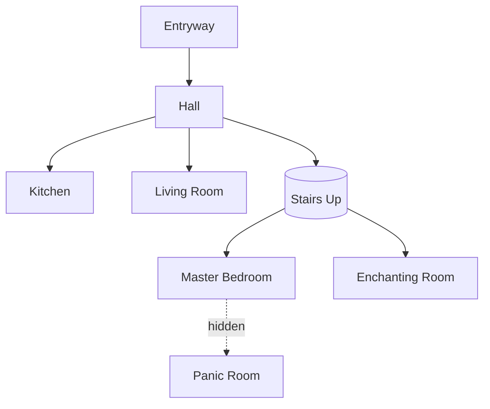

# Blueprint rendering

Propose every design as a blueprint the user can read and react to. Produce
**three artifacts**, written to `.minecraft-builder/<project>/`, and show them
to the user before any block is planned. Iterate on them until the user
approves.

Each mode does something the others cannot:

- **ASCII top-down** (`floorplan.txt`) — the universal quick read, one floor
  per grid.
- **Markdown table** (`floorplan.md`) — a copy-pastable grid with row/column
  coordinates, survives terminal rendering.
- **Mermaid graph** (`adjacency.mmd`) — room-to-room flow that a grid cannot
  show.

## Legend (shared by ASCII and Markdown)

```
#  wall            .  floor           D  door          W  window
B  bed             C  chest           F  furnace       E  enchanting table
b  bookshelf       T  table           c  chair         o  light
~  water           =  path/exterior   +  ladder        ^  stairs up
v  stairs down     |  - interior partition
```

One character = one block. One grid per floor; label each with its Y level.

## ASCII top-down — example

A cozy cottage, single floor:

```
Floor 1 (y=63)
. = = = = = = = = = = .
. # # # W # # W # # . .
. # B B . . . . F # . .
. # B B . . . . o # . .
. # . . . . . . . # . .
. W . . T . . . . # . .
. # . . c c . . . # . .
. # . . . . . . C C # .
. # # # # D # # # # . .
. = = = = = = = = = = .
```

## Markdown table — example

A ground floor with lettered columns and numbered rows so the user can point
at a cell:

```
Floor 1 (y=64)

|   | A | B | C | D | E | F |
|---|---|---|---|---|---|---|
| 1 | # | # | # | W | # | # |
| 2 | # | . | . | . | F | # |
| 3 | W | . | T | . | o | # |
| 4 | # | . | c | . | . | W |
| 5 | # | . | . | . | C | # |
| 6 | # | # | D | D | # | # |
```

## Mermaid adjacency — example

Room flow, with door types as edge labels and hidden links dotted:



## Iteration loop

1. Render all three artifacts.
2. Show them to the user and ask for specific feedback (room sizes,
   adjacencies, style, what is missing).
3. Apply the changes, re-render, show again.
4. Repeat until the user explicitly approves.
5. Only then resolve the approved blueprint into `plan.toon`.

Never resolve a plan from a blueprint the user has not signed off. If the user
wants the highest-fidelity preview, the build can be stubbed in-world in wool
or concrete first — offer this as an option, noting it consumes command
budget; the actual placement is still a `worker` job.
