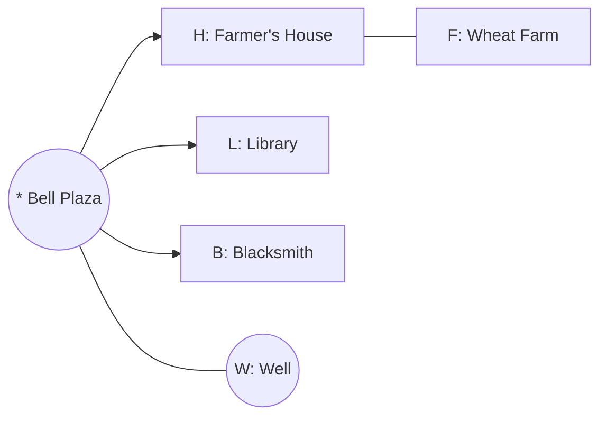

# Village blueprint rendering

Propose every village as **2–3 layout options** the user can compare, then
iterate on the chosen one. Produce three artifacts in
`.minecraft-builder/<project>/` and show them before resolving a plan.

- **ASCII map** (`village.txt`) — top-down, the quick read.
- **Building table** (`village.md`) — every building with its role, size,
  villager, workstation, and bed count.
- **Mermaid graph** (`village.mmd`) — the path network and building flow.

## Legend (ASCII)

```
H  house          B  blacksmith/forge   L  library        A  armorer
C  cartographer   K  cleric/temple      M  meeting hall    W  well
F  farm plot      P  animal pen         T  watchtower      *  bell
.  path           #  wall               ~  water          o  light
```

Note the scale of the map ("1 char ≈ 3 blocks") — villages are large.

## ASCII map — example (plains hamlet)

```
Plains hamlet — 1 char ≈ 2 blocks

      ~ ~ ~ ~ ~
      . . . . . . .
      .   F   .   .        F  wheat farm, worked by the farmer
      . . . . . . .
   H .....*..... L          *  bell on the plaza
      .   W   .             H  farmer's house   L  library
      . . . . . . .         W  well (decorative)
          B                 B  blacksmith
```

## Building table — example

```
| Tag | Building   | Size  | Villager   | Workstation     | Beds |
|-----|------------|-------|------------|-----------------|------|
| H   | small house| 7×7   | Farmer     | composter @F    | 1    |
| L   | library    | 9×7   | Librarian  | lectern         | 1    |
| B   | blacksmith | 7×8   | Toolsmith  | smithing_table  | 1    |
| F   | wheat farm | 9×9   | (farmer)   | —               | —    |
| W   | well       | 5×5   | —          | —               | —    |
| *   | bell       | 1×1   | —          | —               | —    |
Totals: 3 villagers, 3 beds — iron golem: no (spawn one manually).
```

## Mermaid graph — example



## Iteration loop

1. Render 2–3 distinct layout options (e.g. crossroads vs organic cluster).
2. Show them and ask which direction the user prefers, and what to change.
3. Revise the chosen option, re-render, show again.
4. Repeat until the user explicitly approves one layout.
5. Only then resolve it into `plan.toon`.

State the iron-golem status on every rendering (yes / no, with the villager
and bed counts) so the user always sees whether the village will function as
they expect.
